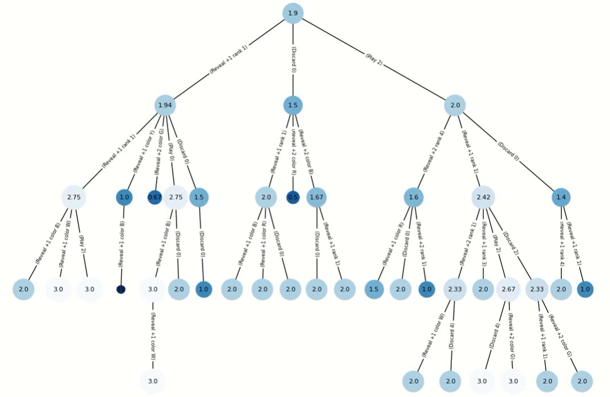

Code source: https://github.com/MBlogs/mcts-hanabi

### Summary
This project implements an Redeterminising Information Set Monte Carlo Tree Search agent into the hanabi\_learning\_environment research platform for Hanabi experiments developed by Google Deep Mind: https://github.com/deepmind/hanabi-learning-environment.

- The Agent determinises on each rollout to fill in unknown information in a way consistent with the hints it is told
- Nodes are information sets, collection of possible states
- New moves 'Return' and 'DealSpecific' were added to the underlying C++ framework to allow direct state manipulation (swapping cards in and out)
- Observation encoding and different Hanabi variations are not supported.



### Paper
MSc project paper and viva can be found in /paper

### Install
Instructions for installing into a new linux environment:
```
sudo apt-get install g++            # if you don't already have a CXX compiler
sudo apt-get install python3        # if don't have python
sudo apt-get install python3-pip3   # if you don't already have pip
pip3 install numpy                   # Python package dependency
pip3 install cffi                    # Python package dependency
sudo apt-get install cmake          # if don't have cmake
sudo apt install git                # if don't have git
git clone https://github.com/MBlogs/mcts-hanabi
cd mcts-hanabi
cmake .                             # Compile
make                       
```
### Running Experiments
```
python3 run_experiment.py --num_episodes 1 --players 3 --agent HumanAgent --agents MCTSAgent --mcts_types 000
```
### Experiment Parameters
Supported parameters and values include:
```
num_episodes: integer. Number of games to include in experiment.
players: integer. Number of players in the game.
agent: First player will be of this type.
agents: Remaining players will be of this type
mcts_types: string. Types for the MCTS agents, each character corresponding to the player position.
```
Supported Agent Classes are:
- VanDenBerghAgent
- FlawedAgent
- MCTSAgent
- OuterAgent
- InnerAgent
- PiersAgent
- IGGIAgent
- LegalRandomAgent
- MuteAgent
- HumanAgent

Type of MCTS agent in a player position is determined by the corresponding character of the mcts_types string. See agents.mcts.mcts_agent.py for full list of possible types

### Experiment Results
run_experiment prints out Python code that defines a list of Experiments objects.
Raw data from experiment runs for the paper can be found in the experiments folder.
experiments/analyse_experiment.ipynb is a notebook that defines the Experiment class to extract this data, and produces the summary tables and graphs seen in the paper